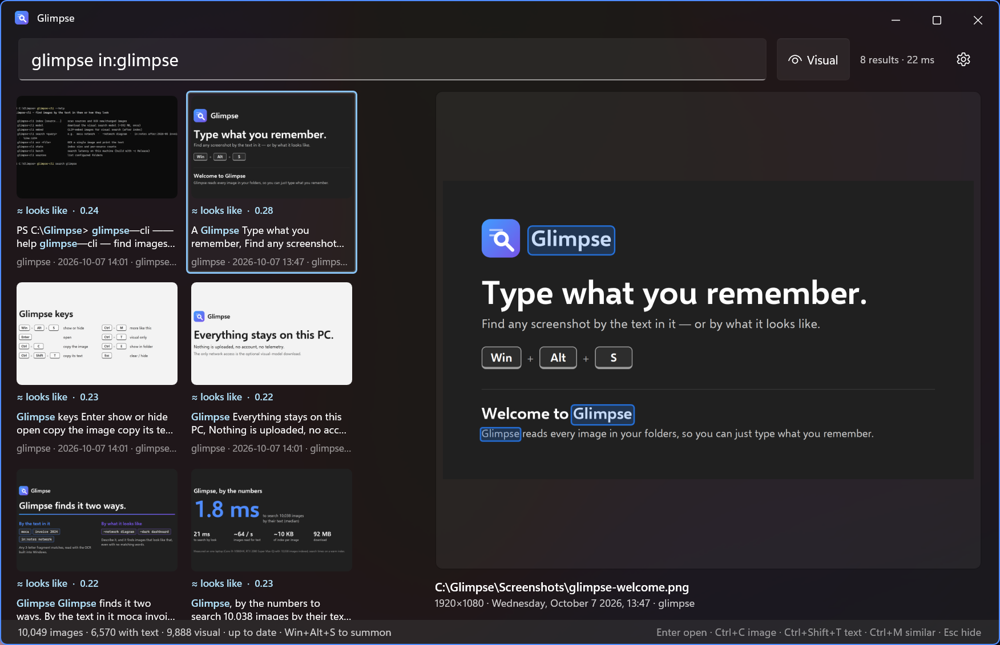

<p align="center">
  
</p>

<h1 align="center">Glimpse</h1>

<p align="center">
  <b>Find any screenshot by the text in it — or by what it looks like.</b><br/>
  Press <kbd>Win</kbd>+<kbd>Alt</kbd>+<kbd>S</kbd>, type a few letters you remember seeing, and it's there.
</p>

<p align="center">
  <a href="../../releases/latest"></a>
  <a href="../../releases"></a>
  <a href="../../actions/workflows/release.yml"></a>
  <a href="LICENSE"></a>
  <br/>
  
  
  
  
</p>

<!-- Screenshot: save it as docs/screenshot.png, then replace this comment with:
<p align="center"></p>
-->

You took a screenshot of that error message, that network diagram, that receipt. You remember what was
in it, not what it was called or when. Glimpse reads every image in your folders, so you can just type
what you remember: **"moca"**, **"invoice 2024"**, **"in:notes network"**. Or describe it — **"network
diagram"**, **"dark dashboard"** — and it finds images that *look* like that, even with no matching words.

- **Text in images:** every screenshot, photo and diagram is read with the OCR built into Windows; any
  3-letter fragment matches, and the matched words are outlined on the preview
- **Search by look:** a CLIP model running on your GPU (or CPU) understands what images show;
  <kbd>Ctrl</kbd>+<kbd>M</kbd> finds images similar to the selected one
- **Grab what you found:** <kbd>Ctrl</kbd>+<kbd>C</kbd> copies the image, <kbd>Ctrl</kbd>+<kbd>Shift</kbd>+<kbd>T</kbd> copies its text
- **Always ready:** lives in the tray, indexes new screenshots as they land, and plugs into PowerToys Command Palette
- **Private:** nothing is uploaded, no account, no telemetry

## By the numbers

Measured on a laptop (Core i9-10980HK, RTX 2080 Super Max-Q) with **10,038 images** indexed
(screenshots, notes attachments, Downloads):

| | |
|---|---|
| Text search | **1.8 ms** median |
| Search by look (visual) | **21 ms** median — most of it is encoding your query with CLIP |
| Text + visual together (the default) | **27 ms** median |
| "More like this" | **1.9 ms** median, across ~10k images |
| Reading text from images | **~64 images/s** (9,284 in 2 min 25 s, 8 workers) |
| Visual indexing | **~95 images/s** on the GPU (9,246 in 1 min 37 s) |
| Index size | **~10 KB per image** (99 MB for 10k images, text + word boxes + visual vectors) |
| Memory | **~250 MB** in the tray with visual search loaded |
| Download | **92 MB**, nothing else to install |

Search times are for the engine on a warm index; run `glimpse-cli bench` to measure your own machine.
## Try it

Download **`Glimpse-<version>-win-x64.zip`** from [Releases](../../releases), extract it, and double-click
**`Install.cmd`**. Test builds aren't code-signed yet, so Windows may say *"Windows protected your PC"*:
click **More info → Run anyway**. A short welcome screen lets you pick folders and (optionally) download
the visual search model; then press **Win+Alt+S**.

- Installs for your user only (`%LOCALAPPDATA%\Programs\Glimpse`), no admin, no .NET install needed
- Windows 10 1809+ / Windows 11, x64; a DirectX 12 GPU speeds up visual search but isn't required
- Uninstall from *Settings → Apps → Installed apps* (you choose whether to keep the index)
- Nothing leaves your PC; the only network access is the optional visual-model download
- Optional: `Glimpse-CmdPal-<version>-win-x64.zip` adds Glimpse to PowerToys Command Palette (needs Developer Mode)

## How it works

OCR is the engine built into Windows (`Windows.Media.Ocr`). The index is SQLite: an FTS5 table with the
trigram tokenizer (so any 3+ character fragment matches anywhere in a word) plus CLIP ViT-B/16 image
embeddings, compared in memory with SIMD. Results merge exact text hits first, then loose text and visual
matches interleaved (reciprocal rank fusion). Inspired by [gyotaku](https://github.com/xevrion/gyotaku) for Linux.

```
src/Glimpse.Core   OCR, SQLite index, incremental indexer, folder watcher
src/Glimpse.Cli    `glimpse-cli` command: index / embed / model / search / ocr / stats / sources
src/Glimpse.App    WinUI 3 search window (unpackaged, Mica, global hotkey, tray, pipe server)
src/Glimpse.CmdPal PowerToys Command Palette extension (MSIX, talks to the app over a named pipe)
```

## Install from source

```powershell
pwsh scripts/install.ps1                # Release build → %LOCALAPPDATA%\Programs\Glimpse, start with Windows, launch in tray
pwsh scripts/install.ps1 -NoAutoStart   # same, without the login entry
```

Re-run to update. Glimpse lives in the tray: left-click toggles the window, right-click for
Re-index now / Settings / Quit. The X button hides to the tray.
Launching it again just brings up the running copy. Windows 11 puts new tray icons in the ^ overflow;
drag it onto the taskbar to keep it visible.

## Develop

```powershell
dotnet build src/Glimpse.App
src/Glimpse.App/bin/x64/Debug/net9.0-windows10.0.19041.0/win-x64/Glimpse.exe           # window
src/Glimpse.App/bin/x64/Debug/net9.0-windows10.0.19041.0/win-x64/Glimpse.exe --hidden  # background, hotkey only

dotnet run --project src/Glimpse.Cli -- index           # all sources
dotnet run --project src/Glimpse.Cli -- search moca
```

The app indexes on startup (only new/changed files) and then watches the folders.

## Visual search

Besides OCR text, every image is embedded with [CLIP](https://openai.com/research/clip) ViT-B/16 (ONNX, run
on the GPU through DirectML, CPU fallback), so you can search by what an image *looks like*: "network diagram",
"bar chart", "dark dashboard". About 1.5 minutes for 9k images on an RTX 2080.

Results are hybrid: **exact** text hits (a one-word query, or the words together as typed) come first, then
loose text hits and visual matches interleaved (reciprocal rank fusion). Visual matches carry a
"≈ looks like" badge. **Visual** toggle (Ctrl+T) or a `~` prefix = visual only. **Ctrl+M** = more like the
selected image.

The model is a one-time ~392 MB download (Settings → Visual search → **Download**, or `glimpse-cli model`)
into `%LOCALAPPDATA%\Glimpse\models\clip-vit-b16`, with resumable, size-checked files. Without it, visual
search is simply off. The app embeds new images after each OCR pass; from the CLI run `glimpse-cli embed`.

## Command Palette

`src/Glimpse.CmdPal` is a [PowerToys Command Palette](https://learn.microsoft.com/windows/powertoys/command-palette/overview)
extension: type **Glimpse** in the palette (Win+Alt+Space) for a live thumbnail grid with a details pane.
Enter opens, **Ctrl+Enter copies the image**, **Ctrl+Shift+T copies its text**, Ctrl+K for copy path / show in folder / more like this /
open in Glimpse. A filter dropdown switches to visual only. Typing 3+ characters on the palette's home
also offers *Search images for "…"* under Fallbacks.

```powershell
pwsh scripts/install-cmdpal.ps1              # build + register (needs Developer Mode, no signing)
pwsh scripts/install-cmdpal.ps1 -Uninstall
```

Tip: give it an alias in Command Palette → Settings → Extensions → Glimpse (e.g. `ss`), then
`ss moca` jumps straight to results. (Every command has a stable id, so aliases and pins survive updates.)

How it fits together: the extension is an MSIX-packaged COM server (that's how the palette loads
extensions). It doesn't open the index itself; it asks the running Glimpse app over a per-user named
pipe (`Glimpse.Core/Ipc/GlimpseIpc.cs`, compiled into both). The app answers from its warm search engine
and includes 256px thumbnails as bytes, because packaged apps get a virtualized view of AppData and
can't read the thumbnail cache by path.

## Search syntax

| Query                  | Meaning                                       |
|------------------------|-----------------------------------------------|
| `moca network`         | both fragments appear (text or file name), plus visual matches |
| `~network diagram`     | visual only (same as the Visual toggle)       |
| `like:1234`            | images that look like image 1234 (Ctrl+M)     |
| `"network map"`        | exact phrase                                  |
| `in:notes`             | source name prefix (`in:screen` = both screenshot folders) |
| `after:2026-05`        | modified on/after (also `2026` or `2026-05-14`) |
| `before:2026-06-15`    | modified before                               |

## Keys

Win+Alt+S toggle · Enter open · Ctrl+C copy image · **Ctrl+Shift+T copy text** · Ctrl+Shift+C copy path · Ctrl+E show in folder · Ctrl+T visual only · Ctrl+M more like this · Ctrl+, settings · Esc clear / hide · Ctrl+Q quit

## Settings

Tray → Settings, the gear in the search bar, or **Ctrl+,**. Changes apply immediately, no restart:

- **Keyboard shortcut**: modifiers + key, checked live against what Windows and other apps already use
- **Start with Windows**
- **Folders**: add (folder picker), remove, rename (the name is what `in:` matches), include subfolders.
  Removing or renaming a folder takes its images out of the index; files are never touched
- **Visual search**: on/off, model download / remove with progress, GPU on/off
- **Indexing**: OneDrive online-only files, parallel workers, index stats, Re-index now, Rebuild,
  thumbnail cache size + Clear
- **About**: version, data folder, log

First run defaults to the Windows *Screenshots* and *Downloads* known folders (following OneDrive backup
or relocation). Everything is stored in `%LOCALAPPDATA%\Glimpse` (`config.json`, `index.db`, `models\`,
`thumbs\`, `glimpse.log`).

## Releasing

```powershell
pwsh packaging/build-release.ps1 -Version 0.5.0   # local: artifacts\*.zip + SHA256SUMS.txt
git tag v0.5.0; git push origin v0.5.0            # CI: builds the same zips and publishes a GitHub release
```

Tags with a suffix (`v0.6.0-beta.1`) publish as pre-releases. *Actions → Release → Run workflow* builds the
zips as an artifact without publishing. Release notes start from `packaging/release-notes.md`.

## License

MIT, see [LICENSE](LICENSE). Bundled components and their licenses: [THIRD-PARTY-NOTICES.md](THIRD-PARTY-NOTICES.md).

## Roadmap

- [x] Visual search (CLIP embeddings via ONNX) — "network diagram", "dark dashboard"
- [x] Tray icon + start with Windows
- [x] Command Palette extension (`ss moca`)
- [x] Settings page (folders, hotkey, visual model download, indexing)
- [x] Copy text (Ctrl+Shift+T, also in Command Palette)
- [x] GitHub releases: self-contained zip, per-user installer/uninstaller
- [ ] Code signing (SmartScreen), signed MSIX for the Command Palette extension, auto-update
- [x] First-run welcome: pick folders, offer the visual model, show the shortcut
- [ ] Clipboard-only snips (Win+Shift+S without auto-save)
- [ ] OCR + embed several GIF frames, not just the first
